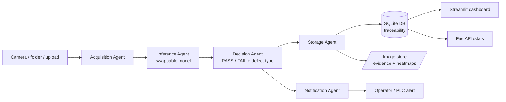
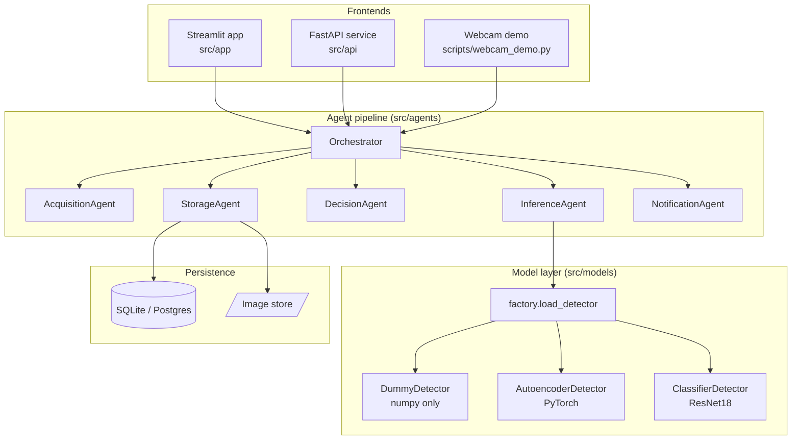
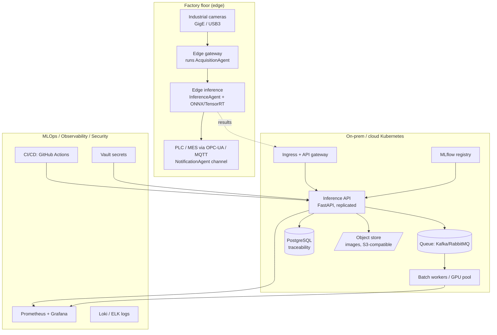

# 01 — Architecture

This document gives the **high-level** picture first, then the **detailed**
component view, then the **production / scale-up** architecture. The first one
is what runs in this repo; the last one is the documented target.

---

## 1. High-level architecture (what runs today)

A single inspection station: an image comes in, a verdict and a stored record
come out.

The orchestrator wires these five agents together. The UI and API are just two
front doors onto the same `Orchestrator.inspect_one()` call.

---

## 2. Detailed component view

**The two seams that make this flexible:**

- `factory.load_detector(backend)` — the **only** place a model is chosen. The
  Inference agent never names a concrete model.
- The `Orchestrator(__init__)` — every agent is injected, so you can replace any
  one (a different camera source, a different alert channel) without touching
  the others.

See `docs/09_agents.md` for a line-by-line walkthrough.

---

## 3. Production / scale-up architecture (the documented target)

This is **not** in the repo as running infrastructure; it is the blueprint the
running core is designed to slot into. Each block notes which existing piece it
wraps.

Mapping to detailed docs:

| Layer | Doc |
|---|---|
| Cameras, lighting, acquisition | `02_data_flow.md`, `03_ai_pipeline.md` |
| Model training, registry, versioning | `04_mlops.md` |
| Containers, K8s, Helm, Terraform | `05_devops_cicd.md` |
| CI/CD pipeline stages | `05_devops_cicd.md` |
| Metrics, logs, drift | `06_monitoring.md` |
| Auth, RBAC, secrets, scanning | `07_security.md` |
| PLC / MES / SCADA / OPC-UA / MQTT | `08_manufacturing_integration.md` |

---

## Why an agent-based design (the central decision)

A naive script would do `acquire → infer → decide → store` in one function. It
works until you need to: change the camera, swap the model, add a second alert
channel, run inference on a GPU box while storage stays local, or test one step
in isolation. Each of those becomes a risky edit to a tangled function.

By splitting the flow into **agents with one job each**, connected through a
thin orchestrator:

- you can replace any agent without touching the rest (open/closed principle);
- you can test each agent alone;
- the same boundaries become **service boundaries** when you later split the
  monolith into microservices (the agents map 1:1 onto future deployable units).

The monolith-now / microservices-later path is covered in `docs/13_roadmap.md`.
