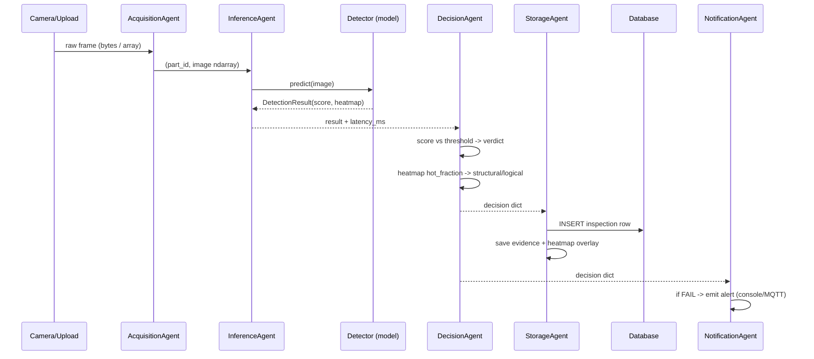
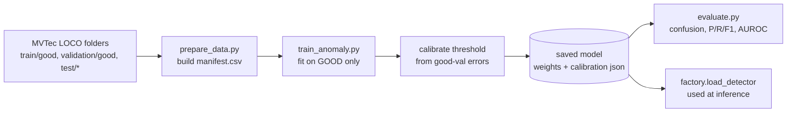

# 02 — Data Flow

This traces a single part from camera to stored verdict, then describes the
dataset flow used for training.

## Inference data flow (one part)

### What each stage produces

| Stage | Input | Output |
|---|---|---|
| Acquisition | camera/folder/upload | `(part_id, image)` as a numpy array |
| Inference | image | `score`, `heatmap`, `latency_ms` |
| Decision | score + heatmap | `verdict`, `defect_type`, `severity`, `confidence` |
| Storage | decision + image | DB row id, archived image + heatmap paths |
| Notification | decision | alert (only when FAIL) |

### The traceability record

Every inspection writes one row with: timestamp, line/station, category,
part id, verdict, defect type, score, threshold, confidence, model name +
version, latency, and the paths to the archived image and heatmap. That row is
what makes the system **auditable**: you can answer "why was part X failed, by
which model, when?" months later.

## Dataset / training data flow

Key point: the model is trained on **good images only**. The test anomalies are
used solely for *evaluation*, never for training — this is what makes it an
anomaly-detection setup rather than ordinary classification.

See `docs/03_ai_pipeline.md` for the modelling detail and `docs/04_mlops.md` for
how versioning/registry would wrap this flow in production.
