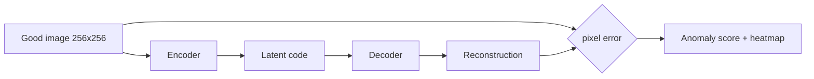
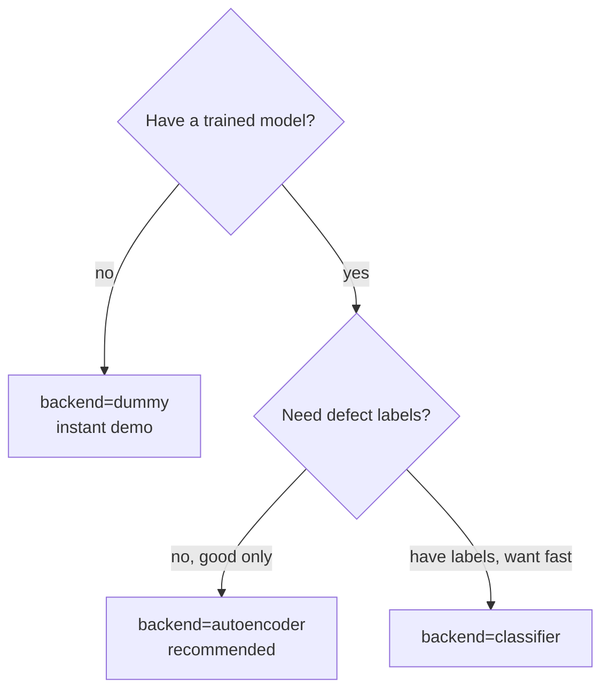

# 03 — AI Pipeline

This explains the computer-vision side: the models, why each exists, how they
are trained, and how they are evaluated. It goes beginner → expert.

## The problem framed correctly

We are doing **anomaly detection**, not ordinary classification. The difference
matters:

- Classification needs many labelled examples of *every* class, including
  defects. Factories rarely have that — defects are rare, varied, and new ones
  appear.
- Anomaly detection learns what *normal* looks like from good parts only, then
  flags anything that deviates. This is the realistic setup, and it is what the
  MVTec LOCO dataset is designed for.

## The three model backends

All three implement the same `BaseDetector` interface (`predict(image) ->
DetectionResult`), so the rest of the system never changes when you swap them.

### 1. `dummy` — numpy-only baseline (always available)

A non-neural detector that scores an image from brightness deviation, edge
deviation, and the maximum local block deviation versus the good parts it was
calibrated on. It exists so that:

- the pipeline, database, API and dashboard run with **zero heavy
  dependencies** (no PyTorch, no GPU, no download);
- CI and tests have something deterministic to check;
- a new contributor sees the whole system work in 10 seconds.

It is **not** meant to be accurate on real data — it is the "hello world" model
that keeps everything runnable.

### 2. `autoencoder` — the recommended real model

A small convolutional autoencoder (encoder 3→32→64→128→128, mirrored decoder,
256 px). It is trained to **reconstruct good images**. At inference, the
reconstruction error is the anomaly score, and the per-pixel error map is the
heatmap.

Why it's the recommended choice:

- trains on good images only (true to the problem);
- gives a natural, localized heatmap (great for the "where is the defect" demo);
- small enough to train on a free Colab GPU in minutes.



Threshold calibration: after training, we run the model over the **good
validation** images, take a high percentile (e.g. 95–99th) of their
reconstruction errors, and use that as the PASS/FAIL threshold. A good part
should sit below it; an anomaly should spike above it.

### 3. `classifier` — ResNet18 transfer-learning alternative

A pretrained ResNet18 with a frozen backbone and a fresh two-class head
(good / defect), 224 px, ImageNet normalization. This is the **quickstart /
fallback** path: it needs a few labelled defect images but trains very fast and
is a familiar baseline for a report's "we also tried transfer learning"
section. Its weakness: it needs labelled defects and gives a weaker
localization map than the autoencoder.

## Choosing a model (and how to switch)



Switching is a single environment variable:

```bash
export IVP_MODEL_BACKEND=autoencoder   # or: dummy | classifier | auto
```

`auto` uses a trained model if one exists on disk, else falls back to `dummy`
so the demo never breaks.

## Evaluation metrics

`src/training/evaluate.py` reports, with no sklearn dependency:

- **Confusion matrix** (TP/FP/TN/FN)
- **Precision, Recall, F1** — recall matters most here: a missed defect
  (false negative) reaches the customer, which is the expensive error.
- **Accuracy** — reported but secondary, since classes are imbalanced.
- **AUROC** — threshold-independent separability (computed via rank-sum).

It also saves a confusion-matrix and ROC plot if matplotlib is available.

## Inference optimization (production target)

For the scale-up path: export to **ONNX**, optionally compile with
**TensorRT**, apply **quantization/pruning**, and use **batch inference** on a
GPU pool. These are documented in `docs/05_devops_cicd.md` and the roadmap; the
`BaseDetector` interface means an ONNX-backed detector drops in as just another
backend.
