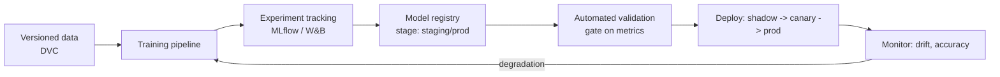

# 04 — MLOps

How the model lifecycle is managed: from data versioning to a deployed,
monitored model. The repo implements the **core** (training, calibration,
evaluation, on-disk model + JSON calibration, a single load point); this doc
describes the production wrap around it.

## The lifecycle

## What exists in the repo today

- **Training pipelines**: `src/training/train_anomaly.py`,
  `train_classifier.py` — reproducible scripts.
- **Calibration as a first-class artifact**: each saved model carries a JSON
  with threshold, image size, and score range. This is a mini "model card":
  the same weights behave differently with a different threshold, so the
  threshold travels *with* the model.
- **A single load point**: `factory.load_detector()` is the registry stand-in —
  one function decides which model serves traffic.
- **Evaluation gate**: `evaluate.py` produces the metrics a promotion decision
  would be based on.

## Production additions (documented target)

### Data versioning — DVC
Track the dataset and its splits as code. `dvc add data/screw_bag`, commit the
`.dvc` pointer; the actual images live in remote storage (S3/GCS). This makes
"which data trained model v7?" answerable.

### Experiment tracking — MLflow (or W&B)
Wrap each training run to log params (lr, epochs, image size), metrics
(F1, AUROC, recall), and the artifact. The autoencoder's calibration JSON
becomes logged metadata.

### Model registry
Promote runs through stages: `None → Staging → Production → Archived`. The
`factory.load_detector()` call becomes "fetch the current Production model for
this category", instead of reading a local file.

### Automated validation (the promotion gate)
A model may only move to Production if it clears thresholds on a frozen holdout:
e.g. **recall ≥ 0.95** (missing a defect is the costly error) and no regression
versus the incumbent. This is a CI job (see `docs/05_devops_cicd.md`).

### Safe deployment patterns
- **Shadow**: new model scores live traffic but its verdicts are not acted on;
  compare against the incumbent offline.
- **Canary**: route a small % of stations to the new model, watch metrics, then
  ramp.
- **Rollback**: registry keeps the previous Production model; flipping back is
  one stage change.

### Drift & degradation monitoring
Track input drift (image brightness/contrast distributions shifting as lighting
or product changes) and output drift (score distribution moving). A sustained
shift triggers a retraining run — closing the loop back to the top.

## SQLite → PostgreSQL migration (concrete, because people ask)

The demo uses SQLite for zero config. Moving to Postgres for production is
deliberately a small change because all DB access is funnelled through
`src/database/db.py`:

1. **Add a driver**: `pip install psycopg2-binary` (already noted in the prod
   profile of `docker-compose.yml`).
2. **Swap the connection**: replace `sqlite3.connect(path)` in
   `get_connection()` with a Postgres connection (read DSN from
   `IVP_DB_DSN`). The SQL is standard; the `inspections` table DDL is portable
   (adjust `INTEGER PRIMARY KEY AUTOINCREMENT` → `SERIAL PRIMARY KEY`).
3. **Point the app at the service**: `docker compose --profile prod up` starts a
   `postgres` container; set `IVP_DB_DSN` to it.

Because the agents only ever call `db.insert_inspection()` /
`db.recent_inspections()` / `db.summary_stats()`, **no agent and no UI code
changes.** That is the payoff of isolating persistence in one module.
