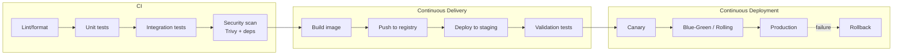
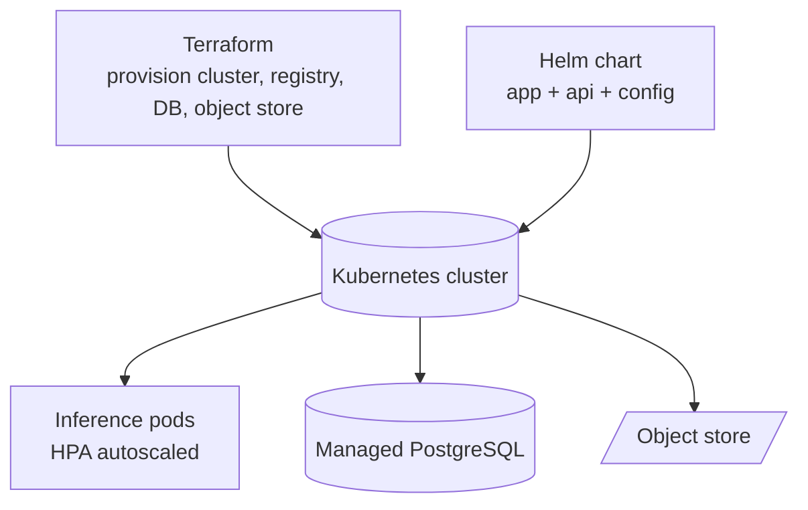

# 05 — DevOps & CI/CD

How the system is packaged, tested, and shipped. The repo ships a working
**Docker + docker-compose + GitHub Actions** setup; the Kubernetes/Helm/Terraform
layer is the documented scale-up.

## What runs today

### Containerization
- `Dockerfile` — multi-stage build on `python:3.12-slim`, installs the OS libs
  OpenCV needs (`libgl1`, `libglib2.0-0`), runs as a **non-root** `appuser`, has
  a healthcheck, and defaults to serving the FastAPI app with uvicorn.
- `docker-compose.yml` — three services:
  - `api` (FastAPI on :8000),
  - `app` (Streamlit on :8501),
  - `postgres` (only under the `prod` profile),
  - a shared `ivp_artifacts` volume so both front-ends see the same DB + images.

```bash
docker compose up                 # api + dashboard, SQLite
docker compose --profile prod up  # adds PostgreSQL
```

### CI — `.github/workflows/ci.yml`
On every push / PR:
1. **Lint + format check** with `ruff`.
2. **Unit tests** with `pytest` (uses the numpy-only core, so CI needs no GPU
   or PyTorch — fast and free).
3. **Docker build** to prove the image still builds.
4. A commented **Trivy** image-scan stub, ready to enable.

## The full CI/CD strategy (documented target)



### CI stages
- Linting/formatting (ruff) — already in repo.
- Unit tests (pytest) — already in repo.
- Integration tests — spin up the API container, POST a known image, assert the
  verdict and that a DB row appears.
- Security scanning — dependency audit + Trivy container scan (see
  `docs/07_security.md`).
- **Model validation gate** — the MLOps promotion check from `docs/04_mlops.md`.

### CD stages
- Build once, tag by git SHA, push to a registry (GHCR/ECR).
- Store artifacts (model, calibration JSON) in object storage.
- Deploy to **staging** automatically; run validation tests there.

### Deployment patterns
- **Rolling update** — default for stateless inference pods.
- **Blue-Green** — keep the old version live, switch traffic atomically, instant
  rollback by switching back.
- **Canary** — 5% → 25% → 100% with metric gates between steps.

## Kubernetes / Helm / Terraform (target, with stubs in `deploy/`)



- **Terraform** provisions the infrastructure (cluster, node pools incl. a GPU
  pool, managed Postgres, object store, registry) — environment per workspace
  (dev/test/staging/prod).
- **Helm** packages the app: one chart, values per environment, so the same
  artifacts deploy everywhere with different config.
- **GitOps** (Argo CD/Flux) — the cluster state is what's in git; merging to
  `main` rolls out.

`deploy/helm/` and `deploy/terraform/` contain minimal placeholder stubs to show
where these live; they are intentionally not full production manifests.

## Multi-environment model

| Env | Purpose | Data | Promotion |
|---|---|---|---|
| Development | feature work | synthetic / sample | on commit |
| Testing | automated CI checks | fixtures | on PR |
| Staging | prod-like rehearsal | anonymized real | on merge to main |
| Production | live line(s) | real | manual approval + canary |
