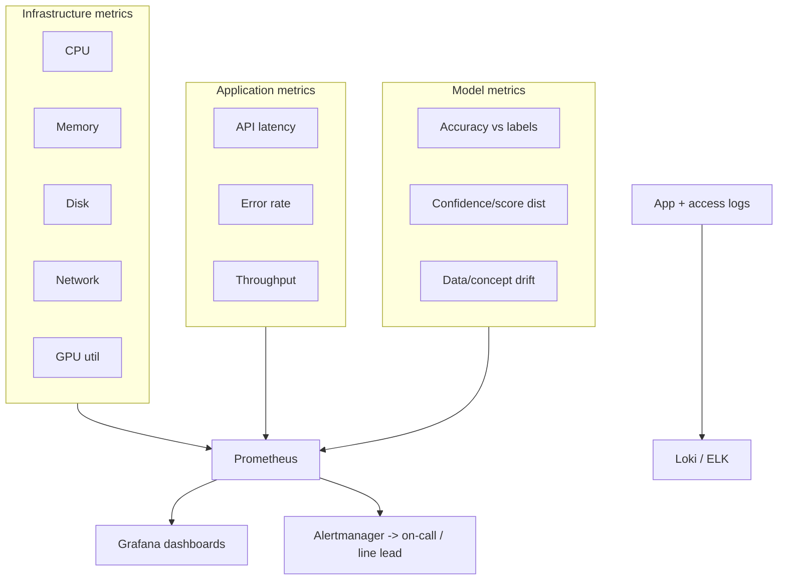

# 06 — Monitoring & Observability

You cannot operate what you cannot see. This covers the three observability
layers — infrastructure, application, and **model** — plus what the repo already
captures that feeds them.

## What the code already records (the foundation)

Every inspection row in the database carries the raw material for monitoring:
`latency_ms`, `score`, `verdict`, `model_name`, `model_version`, and timestamp.
`db.summary_stats()` already computes totals, pass rate, average latency, and a
defect breakdown — that is a metrics endpoint waiting to be scraped, and the
Streamlit dashboard is a first, human-facing monitor.

The FastAPI service exposes `GET /stats`; wrapping the same numbers in a
Prometheus exposition format is a small, well-defined addition.

## The three layers

### Infrastructure
Node/pod CPU, memory, disk, network, and **GPU utilization** (DCGM exporter).
Standard Prometheus node/cAdvisor exporters.

### Application
- **Latency** — already measured per inspection (`latency_ms`); export p50/p95/p99.
- **Error rate** — failed requests, exceptions.
- **Throughput** — inspections/minute (capacity planning per line).

### Model (the one people forget)
- **Accuracy / recall** on periodically-labelled samples — is the model still
  right? Recall is the headline (a missed defect is the expensive miss).
- **Confidence / score distribution** — if scores for "good" parts start
  creeping toward the threshold, something upstream changed.
- **Data drift** — input distribution shift (lighting, new product batch).
- **Concept drift** — the relationship between image and label changes (a new
  defect type appears). Sustained drift → trigger retraining (`docs/04_mlops.md`).

## Stack

| Concern | Tool |
|---|---|
| Metrics collection | Prometheus |
| Dashboards | Grafana |
| Logs | Loki (or ELK) |
| Traces | OpenTelemetry |
| Alerting | Alertmanager → Slack / email / tower light |

## SLIs / SLOs (starting targets)

| SLI | Example SLO |
|---|---|
| Inference latency (p95) | < 200 ms per part |
| Inference service availability | 99.9% monthly |
| Detection recall (rolling, labelled sample) | ≥ 0.95 |
| False-positive rate | ≤ 5% (tunable per line's tolerance) |

These pair with the SRE practices in `docs/11_risk_assessment.md` (error budgets,
incident response).

## Suggested Grafana panels (day one)

- Pass rate over time, split by category/station.
- p95 latency by model version (catches a slow new model in canary).
- Defect-type breakdown (structural vs logical) trend.
- Score distribution histogram for "good" verdicts (early drift signal).
