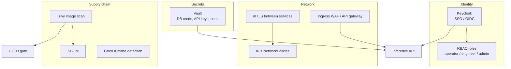

# 07 — Security

Enterprise-grade security for an industrial deployment. The repo applies the
**baseline hygiene** (non-root container, secrets via environment, no
credentials in code, `.gitignore` for secrets); this doc lays out the full
target.

## What the repo already does

- **Non-root container** — the Dockerfile runs as `appuser`, not root.
- **No secrets in code** — all configuration (DB path/DSN, paths, thresholds) is
  read from environment variables in `src/config.py`.
- **Secrets git-ignored** — `.env`, `*.pem`, `secrets/` are in `.gitignore`.
- **Minimal base image** — `python:3.12-slim` reduces attack surface.

## Defense in depth (target)

### Authentication & Authorization
- **Keycloak** (OIDC/SAML) for SSO; tokens validated at the API gateway.
- **RBAC** with least privilege: *operators* see results and acknowledge alerts;
  *quality engineers* tune thresholds and trigger retraining; *admins* manage
  deployments. Map these to the agents — e.g. only an engineer role may change
  the `DecisionAgent` thresholds in production config.

### Secrets management
- **Vault** issues short-lived DB credentials and holds API keys and TLS certs.
- Nothing sensitive in images or git; pods fetch secrets at runtime.

### Encryption
- **In transit**: TLS everywhere; mTLS between internal services.
- **At rest**: encrypted volumes for the database and the image/object store.

### Network security
- Kubernetes **NetworkPolicies** default-deny; only required flows allowed.
- The factory/edge segment is isolated from IT; the OPC-UA/MQTT bridge
  (`docs/08`) is the only controlled crossing point.

### Container & supply-chain security
- **Trivy** scans images for CVEs in CI (stub already in the workflow).
- Generate an **SBOM**; pin dependencies; verify base-image provenance.
- **Falco** for runtime anomaly detection on the cluster.

## Data & privacy notes

- Inspection images may contain product IP — treat the image store as
  confidential; apply retention limits and access logging.
- The traceability DB is an audit source — protect its integrity (append-mostly,
  backups, restricted write access).

## Mapping to the production checklist

The "security readiness" section of `docs/10_production_checklist.md` turns this
into a yes/no gate before go-live.
