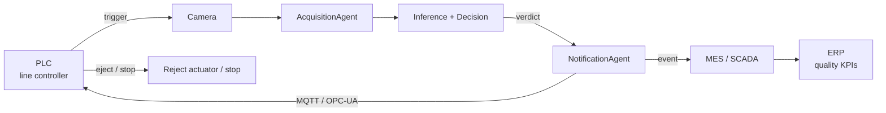

# 08 — Manufacturing Integration (PLC / MES / SCADA / OPC-UA / MQTT)

This is where the vision system meets the actual production line. The repo
already has the **hook**: the `NotificationAgent` has an `mqtt` channel that is
the bridge to factory systems. This doc describes the full integration.

## Where the system plugs into the line

The loop is: **PLC triggers a capture → system inspects → verdict goes back to
the PLC → PLC acts (eject the bad part / stop the line) and logs to MES**.

## The two industrial protocols

### MQTT — lightweight pub/sub (already stubbed in the code)
The `NotificationAgent(channel="mqtt")` publishes a verdict event to a topic
(e.g. `factory/line01/stationA/inspection`). PLCs, SCADA, and dashboards
subscribe. It's ideal for event fan-out and is the simplest first integration.

The payload mirrors the console alert already emitted in the demo: event type,
inspection id, line/station, part id, verdict, defect type, severity, score,
timestamp — so moving from console to MQTT is changing the *sink*, not the data.

### OPC-UA — the industrial standard for machine data
For tighter, typed, secure coupling with PLCs and SCADA, expose/consume an
**OPC-UA** node: the system writes the verdict to a node the PLC reads, or
subscribes to a "part present at station" node that triggers acquisition. OPC-UA
brings built-in security (certs, encryption) and a typed address space — the
preferred path for real PLC control.

## Data exchange flows

| Direction | Content | Transport |
|---|---|---|
| PLC → system | "part at station, capture now" | OPC-UA node / digital I/O |
| system → PLC | PASS/FAIL (+ reject signal) | OPC-UA node / MQTT |
| system → MES | full inspection record | MQTT / REST |
| MES → ERP | aggregated quality KPIs | existing MES↔ERP link |

## Error handling on the floor (safety-critical)

- **Fail-safe default**: if the vision system is unreachable or times out, the
  line must take the *safe* action defined by quality policy — typically treat
  the part as suspect (reject/divert) rather than pass it. This is a PLC-side
  rule; the system's job is to respond within the latency SLO or signal
  unavailability.
- **Heartbeat**: the system publishes a liveness signal; the PLC alarms if it
  stops.
- **Backpressure**: if parts arrive faster than inference, queue with a bounded
  buffer and shed/slow via the PLC rather than silently dropping inspections.
- **Idempotent records**: each inspection has a unique id so a retried
  notification never double-counts.

## Why this stays clean in the code

All of the above lives behind **one agent**. The inspection logic (acquisition,
inference, decision, storage) has no idea whether the verdict ends up on a
console, an MQTT topic, or an OPC-UA node. Swapping or adding a floor protocol is
a change to `NotificationAgent` (and optionally `AcquisitionAgent` for the
trigger), never to the pipeline — exactly the separation argued in
`docs/09_agents.md`.
