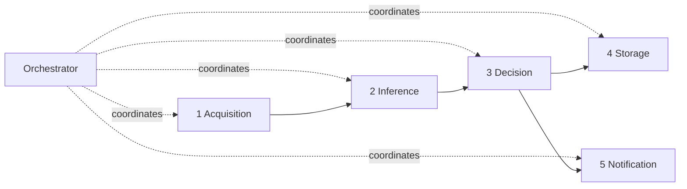

# 09 — The Agents, Explained (beginner → expert)

This is the document the project owner specifically asked for: **what each agent
is, what its code does, how agents interact, and how to switch one for another.**

If you read only one design document, read this one.

---

## What is an "agent" here?

In this project an *agent* is just a small Python class with **one job** and a
clear input/output. It is not an LLM agent and not a background process — think
of it as one worker on an assembly line. Five workers stand in a row; a sixth
(the **Orchestrator**) hands the part down the line and collects the result.



Why bother splitting it up? Because in a real factory every one of these pieces
changes independently: the camera, the model, the quality rules, where data is
stored, who gets alerted. Isolating each into its own agent means **you change
one box without breaking the others** — and you can test each box alone.

---

## The six agents at a glance

| # | Agent | One-line job | The thing it hides from everyone else |
|---|---|---|---|
| 1 | **Acquisition** | get an image into the system | *where pixels come from* |
| 2 | **Inference** | run the model, measure latency | *which model is used* |
| 3 | **Decision** | score → PASS/FAIL + defect type | *the quality policy* |
| 4 | **Storage** | archive image + write DB row | *where data is persisted* |
| 5 | **Notification** | alert on failures | *which channel alerts go to* |
| 6 | **Orchestrator** | wire the five together | *the order of the steps* |

---

## 1. AcquisitionAgent — `src/agents/acquisition_agent.py`

**Role.** The only agent that knows where pixels come from. It outputs a clean
`(part_id, image)` where `image` is a numpy RGB array. Everything downstream is
identical whether the picture came from a webcam, a folder, or a €4,000
industrial GigE camera.

**Code shape.** Three source methods:
- `from_folder(folder)` — yields every image in a directory (development / batch).
- `from_array(image)` — wraps an already-decoded array (file upload in the app).
- `from_webcam(index)` — yields live frames (the webcam demo).

**Why separate.** The image source is the single most environment-specific thing
in the whole system. Keep it in one place and the other four agents never have
to care.

---

## 2. InferenceAgent — `src/agents/inference_agent.py`

**Role.** The only agent that touches a model. Given an image it returns a
`DetectionResult` (anomaly `score` + `heatmap`) and the `latency_ms` it took
(latency is recorded for monitoring).

**Code shape.**
```python
def __init__(self, detector=None):
    self.detector = detector or load_detector()   # factory picks the model
def run(self, image):
    t = time.perf_counter()
    result = self.detector.predict(image)
    return result, (time.perf_counter() - t) * 1000
```

**Why separate.** The model is the part that changes *most often* — you retrain
weekly, you A/B test, you swap autoencoder for classifier. Because this agent
depends only on the `BaseDetector` **interface**, swapping the model is a config
change, not a code change.

---

## 3. DecisionAgent — `src/agents/decision_agent.py`

**Role.** Turn the model's raw number into a **business decision**. A model
outputs `0.82`; the factory needs "FAIL, structural defect, high severity". That
translation is quality *policy*, not machine learning, so it lives apart from the
model.

**Code shape.** Compares `score` to `threshold` → `verdict`; inspects the
heatmap's "hot fraction" to label the defect **structural** (a localized hot
spot) vs **logical** (diffuse / none); derives a `severity`. A future rule like
"two borderline parts in a row → stop the line" would live here.

**Why separate.** A quality engineer can retune thresholds and defect naming
without ever opening the model code.

---

## 4. StorageAgent — `src/agents/storage_agent.py`

**Role.** Make every inspection permanent and auditable. Saves the evidence
image and the heatmap overlay to disk, and writes **one database row** with the
full context: timestamp, line/station, verdict, defect type, score, threshold,
model name + version, latency, and the image paths.

**Why separate.** Persistence is a cross-cutting concern. Today it writes to
SQLite + local disk; to move to PostgreSQL + S3 in production you edit **this one
agent** and the pipeline keeps calling `storage.save(...)` unchanged.

---

## 5. NotificationAgent — `src/agents/notification_agent.py`

**Role.** Tell the outside world when a part **fails**, so a human or machine can
act — light a tower lamp, eject the part, ping a supervisor. Fires on FAIL only.

**Code shape.** Two channels:
- `"console"` — prints a JSON alert (used in the demo, needs nothing).
- `"mqtt"` — publishes to an MQTT topic (the bridge to PLC/MES/SCADA; uses
  `paho-mqtt`, imported lazily so the demo runs without a broker).

**Why separate.** Who gets alerted is site-specific. Swapping console → MQTT →
email never touches inspection logic. Full floor-integration design is in
`docs/08_manufacturing_integration.md`.

---

## 6. Orchestrator — `src/agents/orchestrator.py`

**Role.** The conductor. It owns one instance of each agent and runs them in
order in `inspect_one(part_id, image)`, returning a single result dict that both
the API and the dashboard display.

**The crucial detail — dependency injection.** Every agent is a constructor
argument:

```python
Orchestrator(
    acquisition=AcquisitionAgent(),
    inference=InferenceAgent(),
    decision=DecisionAgent(),
    storage=StorageAgent(),
    notification=NotificationAgent(),
)
```

Pass nothing and you get sensible defaults. Pass your own and you override just
that step. **This is the mechanism for "switching agents".**

---

## How to switch things (the part you'll actually use)

### Switch the MODEL — one environment variable

```bash
export IVP_MODEL_BACKEND=dummy        # numpy baseline, no training needed
export IVP_MODEL_BACKEND=autoencoder  # recommended trained model
export IVP_MODEL_BACKEND=classifier   # ResNet18 transfer-learning
export IVP_MODEL_BACKEND=auto         # trained if available, else dummy
```

`InferenceAgent` calls `factory.load_detector()`, which reads this variable.
Nothing else in the code changes.

### Switch an AGENT — inject a replacement

Want alerts to go to a PLC instead of the console? Build the orchestrator with a
different NotificationAgent:

```python
from src.agents.notification_agent import NotificationAgent
from src.agents.orchestrator import Orchestrator

orch = Orchestrator(notification=NotificationAgent(channel="mqtt"))
```

Want frames from a webcam instead of a folder? Same idea with
`AcquisitionAgent`. Want a custom quality rule? Subclass `DecisionAgent`, pass
your instance. In every case **only the orchestrator constructor line changes.**

### Add a brand-new agent

1. Write a class with one clear method (e.g. a `MetricsAgent.record(result)`).
2. Accept it in the `Orchestrator.__init__`.
3. Call it at the right point in `inspect_one`.

No existing agent needs to change — that is the whole point of the design.

---

## Why this maps cleanly to microservices later

Each agent already has a narrow interface and no hidden coupling. When one
station becomes a hundred, the five agents become five **independently
deployable services** (e.g. inference on a GPU pool, storage as a write service),
communicating over a queue instead of in-process calls. The boundaries you see
here are the same boundaries you would split on. That migration is described in
`docs/13_roadmap.md`.
