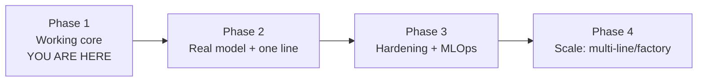

# 13 — Roadmap & Optimization

The path from "runs on a laptop" to "runs a factory", staged so each step
delivers value and nothing requires a rewrite. The agent + factory design is
what makes this incremental.

## Phased plan

### Phase 1 — Working core ✅ (this repo)
Agent pipeline, swappable models, SQLite traceability, API + dashboard, Docker,
CI, demo that runs with no dataset. Deployable for a single proof-of-concept
station.

### Phase 2 — Real model on one real line
- Download MVTec LOCO (or capture your own good parts), train the autoencoder.
- Calibrate the threshold on real good-validation images.
- Run the dashboard next to the line; compare verdicts with a human inspector
  for a week (shadow mode, no line control yet).
- **Exit criteria**: recall ≥ 0.95 on a labelled holdout; operators trust it.

### Phase 3 — Hardening + MLOps
- Swap SQLite → PostgreSQL (one module, `docs/04`).
- Stand up MLflow registry + DVC; add the promotion gate to CI.
- Add Prometheus/Grafana + drift detection (`docs/06`).
- Add Keycloak/RBAC + Vault (`docs/07`).
- Integrate with the PLC via MQTT/OPC-UA in **read-only/advisory** mode first,
  then closed-loop reject (`docs/08`).

### Phase 4 — Scale
- Kubernetes + Helm + Terraform; autoscaling inference; GPU pool for batch.
- Split the agents into independent services where load demands it
  (inference service, storage service) — the boundaries already exist.
- Per-category and per-line models in the registry; canary new versions.
- Multi-factory: same chart, per-site values; central registry + dashboards.

## Monolith → microservices (when, not just how)

Don't split early. The in-process agent pipeline is simpler to run and debug, and
most single-line deployments never need more. Split a given agent into a service
only when it has a *different* scaling or availability need:

| Trigger | Split out |
|---|---|
| Inference is the bottleneck / needs GPUs | Inference service on a GPU pool |
| Many stations write concurrently | Storage/write service + queue |
| Alerts must survive pipeline restarts | Notification service on a broker |

Because each agent already has a narrow interface, "split" means putting a queue
or RPC between two boxes that already don't share state — not redesigning.

## Performance optimization backlog

- **ONNX export** of the autoencoder → portable, faster CPU inference.
- **TensorRT** + **quantization** on the GPU path → higher throughput per card.
- **Batch inference** for high-rate lines.
- **Pruning** if model size/latency becomes a constraint at the edge.

All of these enter the system as **a new `BaseDetector` backend**, selectable via
`IVP_MODEL_BACKEND`, so adopting them changes no pipeline code.

## Suggested next concrete step

Train the autoencoder on one category and run `make app`. That single exercise
exercises the whole Phase 2 path and produces the metrics your report needs.
